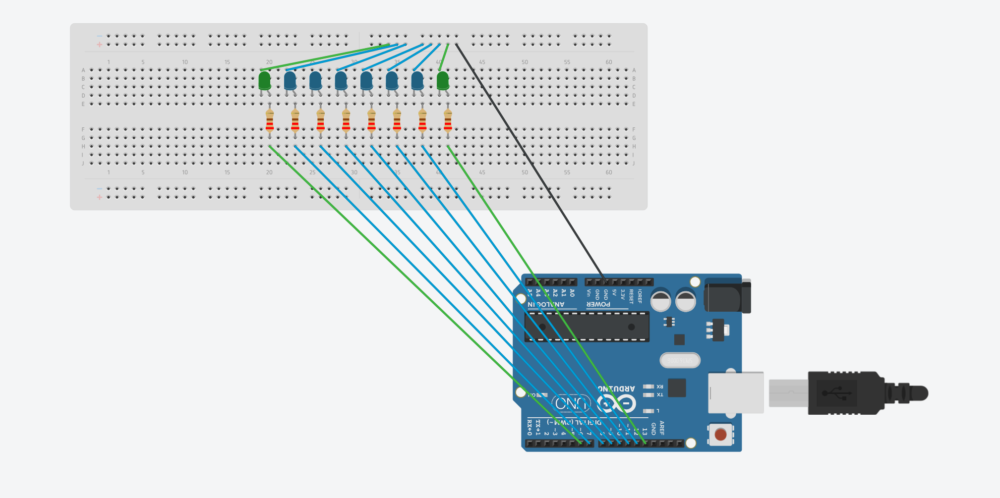

# 8-Bit-LED-Counter

## Project Objective
This project aims to implement an 8-bit binary counter using an Arduino and 8 LEDs. The counter displays values from 0 to 255 in binary format, helping visualize how binary counting works through hardware.

## Project Scheme

## Circuit Scheme

## Components Used

<table>
  <thead>
    <tr>
      <th>Component</th>
      <th>Quantity</th>
      <th>Description</th>
    </tr>
  </thead>
  <tbody>
    <tr>
      <td>LED</td>
      <td>8</td>
      <td>Indicator LEDs for binary bits</td>
    </tr>
    <tr>
      <td>Resistor</td>
      <td>8</td>
      <td>220Ω each (for current limiting)</td>
    </tr>
    <tr>
      <td>Arduino Uno</td>
      <td>1</td>
      <td>Microcontroller board</td>
    </tr>
    <tr>
      <td>Jumper Wires</td>
      <td>~16</td>
      <td>For circuit connections</td>
    </tr>
    <tr>
      <td>Breadboard</td>
      <td>1</td>
      <td>Used for prototyping the circuit</td>
    </tr>
  </tbody>
</table>

